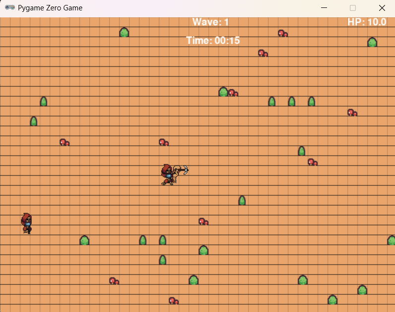

# Roguelike Defense - Projeto de Avaliação Kodland

 <!-- Adicione uma imagem se possível -->

Projeto desenvolvido como teste prático para o processo seletivo de professor na **Kodland Brasil**. O desafio consistia em criar um jogo utilizando exclusivamente as bibliotecas:
- `pgzero`
- `random`
- `math`
- `Rect` do Pygame

## 🎮 Sobre o Jogo
**Gênero:** Roguelike de defesa com elementos estratégicos  
**Premissa:** Sobreviva o máximo de tempo que puder contra hordas de inimigos que se tornam progressivamente mais fortes. Sobreviva o máximo possível e marque seu recorde!

### Funcionalidades Implementadas:
- ✅ Geração procedural de mapas
- ✅ Sistema de ondas com aumento de dificuldade
- ✅ Menu interativo com controles de som/música
- ✅ Animções spritesheet para personagens
- ✅ Sistema de combate tático
- ✅ Tela de Game Over com estatísticas

## 🛠 Tecnologias Utilizadas
| Biblioteca | Finalidade |
|------------|------------|
| `pgzero` | Framework principal para construção do jogo |
| `random` | Geração de números aleatórios para mapas |
| `math` | Cálculos geométricos e de movimento |
| `Rect` | Gerenciamento de colisões e áreas |

## ⚙️ Como Executar
1. **Pré-requisitos:**
   - Python 3.10+ instalado
   - Dependências:  
     ```bash
     pip install pgzero pygame
     ```

2. **Execução:**
   ```bash
   python Main.py

## 🎮 Controles

- **Teclado:**
  - ⬆️ **Cima**: Movimento para cima
  - ⬇️ **Baixo**: Movimento para baixo
  - ⬅️ **Esquerda**: Movimento para esquerda
  - ➡️ **Direita**: Movimento para direita
  - `Espaço`: Ataque (automático quando próximo a inimigos)

- **Mouse:**
  - Navegação no menu

## 📝 Notas do Desenvolvedor

Este projeto representa um desafio técnico significativo devido às restrições impostas:

- **Limitações Técnicas:**
  - Uso restrito a bibliotecas básicas (`pgzero`, `random`, `math`, `Rect`)
  - Implementação manual de sistemas normalmente prontos em engines
  - Adaptação de fluxo Godot → Python puro

- **Conquistas Técnicas:**
  - ✅ Sistema de progressão de ondas
  - ⚖️ Balanceamento dinâmico de dificuldade
  - 🎨 Feedback visual claro para ações

> *"Optei por um roguelike por permitir demonstrar habilidades em:*
> - *Lógica procedural*
> - *Gerenciamento de estados*
> - *Design de sistemas escaláveis*
> 
> *Embora simplificado, o projeto valida conceitos fundamentais de programação de jogos."*

## 📌 Considerações Finais

Este trabalho comprova capacidade de:

- 🔄 Adaptação a tecnologias diferentes
- 💡 Solução criativa com recursos limitados
- 📚 Organização de código (PEP8)
- 📄 Criação de documentação clara

---

**Desenvolvido com ❤️ por [Heitor Nery]**  
*Candidato à vaga de professor de desenvolvimento de jogos na Kodland Brasil*

📧 **Contato:** [joseheitorneryviana@gamil]  
🔗 **[Portfólio Completo](https://heitornery.itch.io/)**